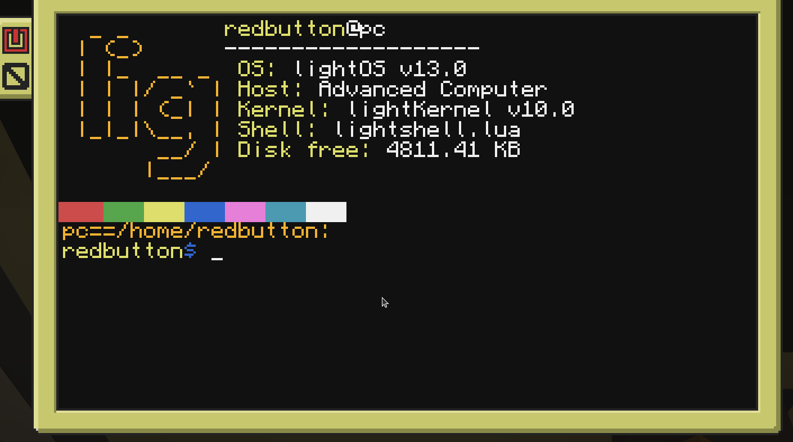
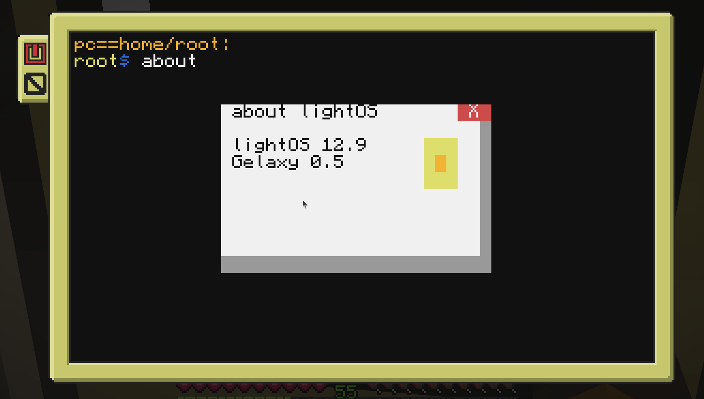
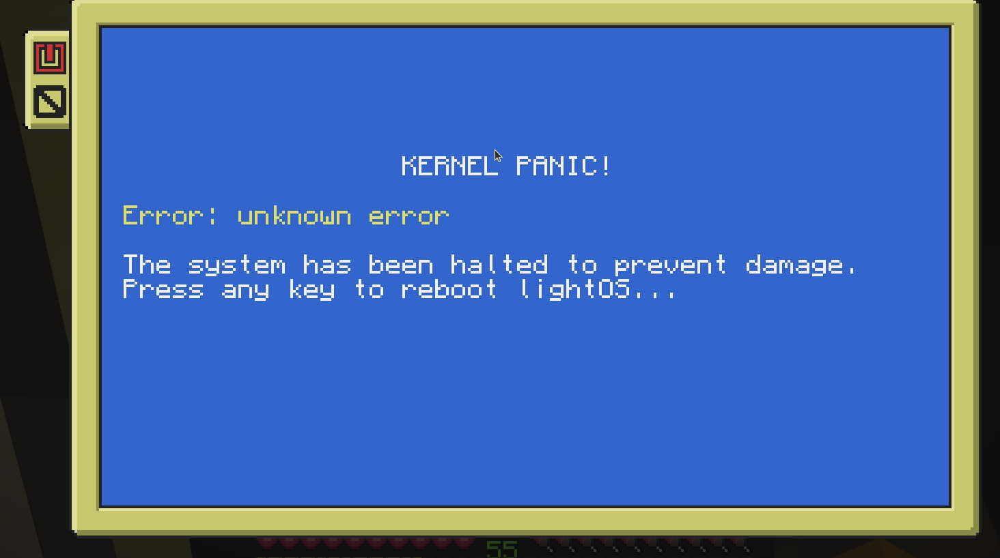
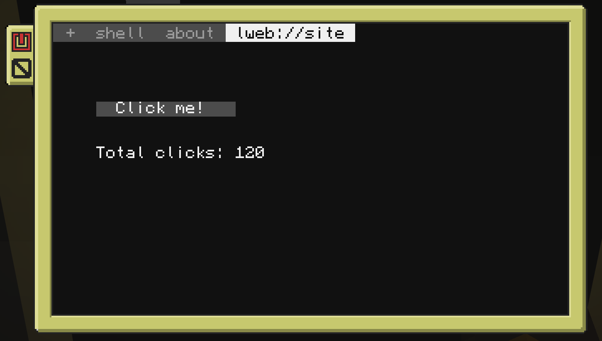
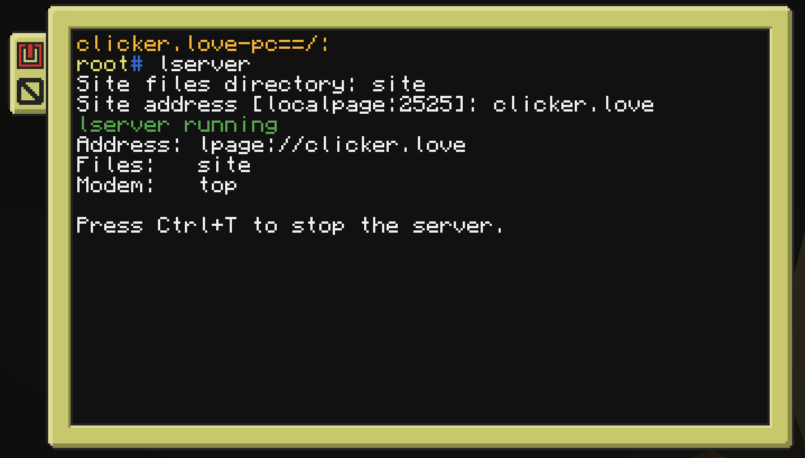

# lightOS v14
## For ComputerCraft and it fork CC: Tweaked

<p align="center">
  
  
  
</p>

## To install the lightOS
```
pastebin run 7pwFMZW8
```
# In last update
<p align="center">
  
  
</p>


## How to create a user?
```lua
usermgr add user
-- Delete
usermgr del user
```

### The lightOS under GNU GPL License version 3.0 or above you can read license in file License

#### Please read a documentations in Docs/